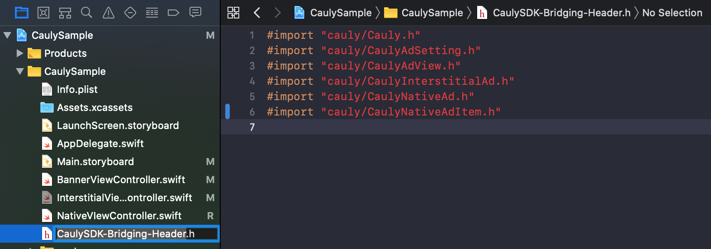

# Static Library 연동

본 페이지에서는 **수동 다운로드 방식 중 Static Library 방식**으로\
Cauly iOS SDK를 연동하는 방법을 안내합니다.

Static Library 방식은\
기존 레거시 프로젝트 또는 `.a` 기반 라이브러리를 사용 중인 환경과의\
호환을 위해 제공됩니다.


가능하다면 **XCFramework 방식 사용을 권장**합니다.

Static Library 방식은 **유지·호환 목적의 설치 방법**입니다.


***

### Static Library 방식 개요

Static Library 방식에서는\
아래 구성 요소를 프로젝트에 직접 추가하여 연동합니다.

* `.a` 라이브러리 파일
* Cauly SDK 헤더 파일
* iOS 시스템 Framework
* (Swift 프로젝트인 경우) Bridging Header 설정


Static Library 방식에서는

**`CaulySDK.xcframework`를 사용하지 않습니다.**


***

### 1. Static Library 파일 추가

#### 1-1. 라이브러리 파일 선택

프로젝트 환경에 따라 아래 중 하나를 선택합니다.

| 파일명                    | 설명              |
| ---------------------- | --------------- |
| `libCauly.a`           | iOS 디바이스 전용     |
| `libCauly-universal.a` | 시뮬레이터 + 디바이스 통합 |


일반적인 개발 환경에서는

**`libCauly-universal.a` 사용을 권장**합니다.


***

#### 1-2. 라이브러리 파일 추가

1. Xcode 프로젝트를 엽니다.
2. **Targets → General → Frameworks, Libraries, and Embedded Content**로 이동합니다.
3. 선택한 `.a` 파일을 추가합니다.

***

### 2. Cauly SDK 헤더 파일 추가

Static Library 방식에서는\
Cauly SDK 헤더 파일을 프로젝트에 함께 추가해야 합니다.

#### 제공 헤더 파일

* `Cauly.h`
* `CaulyAdSetting.h`
* `CaulyAdView.h`
* `CaulyInterstitialAd.h`
* `CaulyNativeAd.h`
* `CaulyNativeAdItem.h`

***

### 3. 시스템 Framework 추가

Cauly iOS SDK는 내부적으로 iOS 시스템 Framework를 사용합니다.\
아래 Framework를 프로젝트에 추가해 주세요.

#### 필수 Framework

* `AVKit.framework`
* `UIKit.framework`
* `Foundation.framework`
* `CoreGraphics.framework`
* `QuartzCore.framework`
* `SystemConfiguration.framework`
* `MediaPlayer.framework`
* `CFNetwork.framework`

***

#### Optional 설정이 필요한 Framework

아래 Framework는 추가 후\
**Status를 `Required` → `Optional`로 변경**해야 합니다.

* `MessageUI.framework`
* `EventKit.framework`
* `AdSupport.framework`

***

### 4. Swift 프로젝트 – Bridging Header 설정


**이 단계는 Swift 프로젝트에서만 필요합니다.**

Objective-C 프로젝트인 경우 본 단계를 건너뛰세요.


***

#### 4-1. Bridging Header 파일 생성

Swift 프로젝트에서 Objective-C 기반 Static Library를 사용하기 위해\
Bridging Header 파일을 생성합니다.

**파일명 예시**

```
프로젝트명-Bridging-Header.h
```

***

#### 4-2. 헤더 파일 import

생성한 Bridging Header 파일에\
아래와 같이 Cauly SDK 헤더를 import 합니다.

```objc
#import "cauly/Cauly.h"
#import "cauly/CaulyAdSetting.h"
#import "cauly/CaulyAdView.h"
#import "cauly/CaulyInterstitialAd.h"
#import "cauly/CaulyNativeAd.h"
#import "cauly/CaulyNativeAdItem.h"
```

<figure><figcaption></figcaption></figure>

***

#### 4-3. Bridging Header 등록

Xcode에서 다음 경로로 이동합니다.

```
Build Settings
 → Swift Compiler - General
 → Objective-C Bridging Header
```

값에 생성한 Bridging Header 파일 경로를 입력합니다.

**예시**

```
CaulySample/CaulySDK-Bridging-Header.h
```

<figure><figcaption></figcaption></figure>

***

### 5. Import 및 사용 방법



```
Swift 코드에서는 Bridging Header 설정 후,
별도의 import 없이 바로 사용 가능합니다.
```



```objc
#import "Cauly.h"
#import "CaulyAdView.h"
#import "CaulyInterstitialAd.h"
#import "CaulyNativeAd.h"
```



***

### 6. Static Library 방식에서 주의할 점

* ❌ `CaulySDK.xcframework`를 추가하지 마세요.
* ❌ XCFramework 방식과 혼용하지 마세요.
* ⭕ `.a` 파일 + 헤더 파일 조합만 사용하세요.
* ⭕ Swift 프로젝트에서는 Bridging Header 설정이 필수입니다.

혼용 시 다음 문제가 발생할 수 있습니다.

* 중복 심볼 오류
* 링크 에러
* 런타임 크래시

***

### 주의 사항

* Static Library 방식과 XCFramework 방식은\
  **동시에 사용할 수 없습니다.**
* 설치 방식에 따른\
  **광고 기능, API, 동작 차이는 없습니다.**
* 최신 SDK Version은\
  **모든 설치 방식에 공통 적용**됩니다.
